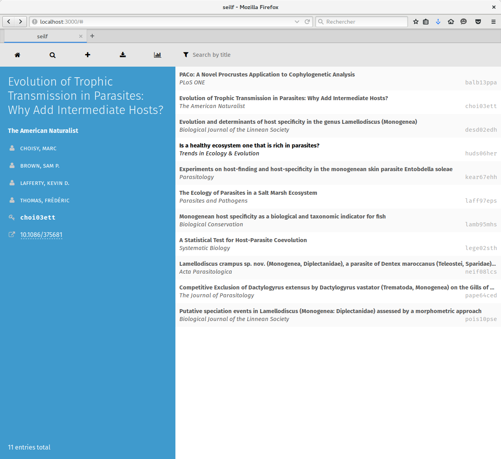

# seilf

Uses `hylla` to look at references in the browser. Start with `node index.js`
and go to `localhost:3000`. Click on a reference in the list to have it
displayed in the left bar. Type something on the bottom field to search in the
titles. There is a pre-installed list of references (about parasites, mostly).

If you want to make changes to the code, it's recommended to use `supervisor`
instead:

~~~ sh
sudo npm install -g supervisor
supervisor index.js
~~~

By the way... *hylla* is Swedish for shelf, and *seilf* is Irish for the exact
same thing.

## Obligatory screenshot (outdated)

## Screencast!

## How to use it

- Click on any entry from the list to see the details
- Click on the download icon to get the `default.json` file ready to be used with `pandoc`
- Click on the magnifying glass icon to add refences by copyin/pasting from anywhere
- Type in the top bar to filter the entries based on the title

## Roadmap

- Add entries manually
- Search by author
- Statistics
- Edition
- PDF download
